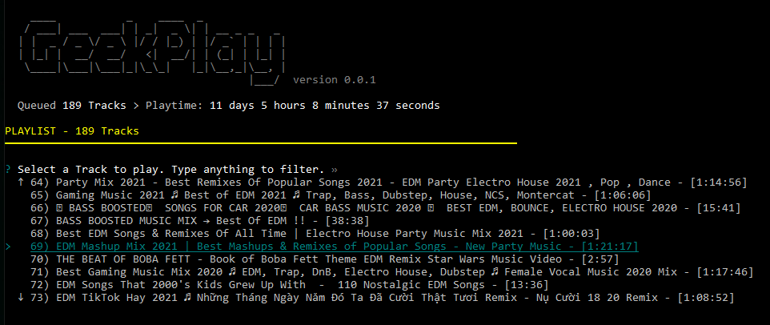

# Playback Commands

While the **GeekPlayer** is running, you can further control your player using a series of **hotkey commands**.

- Arrow keys ← and → are used to skip tracks. 
    
    ← takes you to the previous track while → skips to the next track.

- The *space bar* is used to pause and resume playback.
- Pressing "P" brings up the current playlist window. 

    Use the ↑ and ↓ arrow keys as well as Page Up and Page Down to select a track and the Return/Enter key to submit option and return to the main player window.

    

