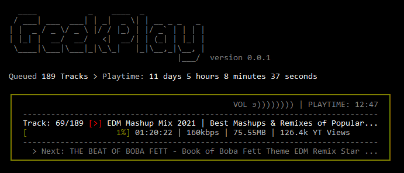

# Playback

**GeekPlay** will eventually support music from multiple sources. However, at the moment, only YouTube is supported.

To play your music simply pass your search term, playlist or video link to **GeekPlay** as follows:

```
$ geekplay search term
$ geekplay https://youtube.com....playlist
$ geekplay https://youtube.com...video_link
```
The player will fetch the tracks, and queue them for playback.



Next >> [Playback](./playback)
